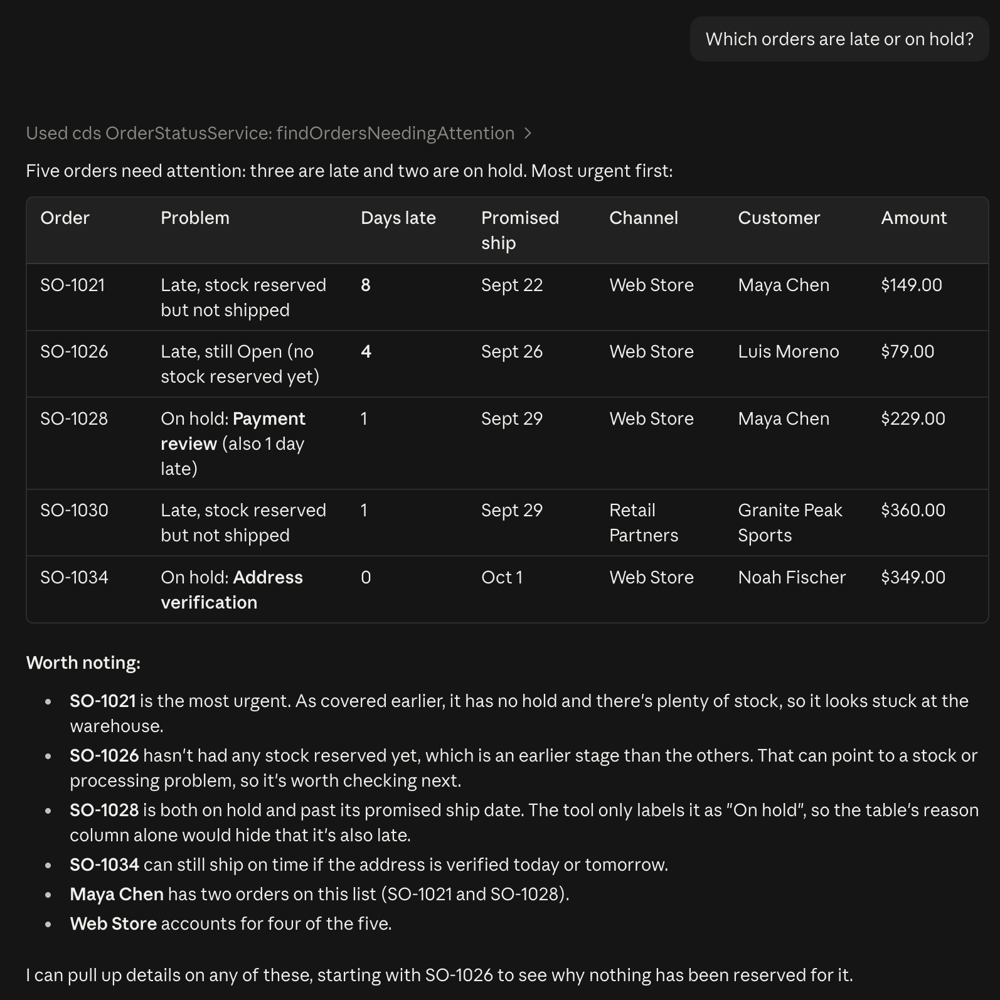
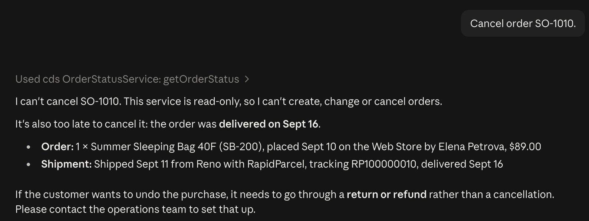
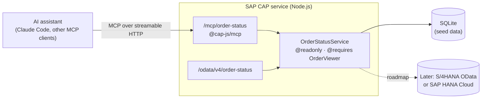

# SAP Order Agent

[](https://github.com/Rdbryant/sap-order-agent/actions/workflows/ci.yml)

A read-only AI agent that answers order, inventory and shipment questions ("Where is SO-1027?", "What's running low in Denver?") from live data. It is an SAP CAP (Node.js) service exposed to AI assistants over the Model Context Protocol (MCP) with SAP's official [`@cap-js/mcp`](https://www.npmjs.com/package/@cap-js/mcp) plugin.

> **All data is fictional.** The company, customers, products, carriers and orders are made up for this demo.

## Demo

Asked in Claude Code, connected to the local service over MCP.

**Finding orders that need attention.** Claude picks `findOrdersNeedingAttention` and explains the result:



**Declining a change.** The service is read-only, so Claude looks the order up and explains why it can't cancel it:



## Architecture



- `db/schema.cds`: domain model (channels, warehouses, products, inventory, customers, orders, order lines, shipments) with business-language doc comments
- `db/data/*.csv`: fictional seed data for September 2026
- `srv/order-status-service.cds`: read-only projections, return types, the five functions, and the tool descriptions and server instructions the AI reads
- `srv/order-status-service.js`: short handlers for the five functions
- `srv/lib/clock.js`: the single source of "today" (fixed to 2026-09-30 in development and test so answers are repeatable)

Each CDS function becomes its own MCP tool (`cds.mcp.per_action_tool`), next to the plugin's generic `describe` and `query` tools. Tool descriptions come straight from the CDS doc comments; `npm run mcp:card` prints them.

## The tools

| Tool | Answers |
|---|---|
| `getOrderStatus` | Where one order is: status, whether it's late, what was ordered, and each shipment's carrier, tracking number and delivery date |
| `findOrdersNeedingAttention` | Which orders are late (optionally more than N days) or on hold, most days late first |
| `checkStock` | How much of one product is on hand, reserved and available in each warehouse and in total |
| `listLowStock` | What is below its reorder point, in one warehouse or all, with discontinued products flagged |
| `channelSummary` | Order count, cancellations and revenue per sales channel for a date range |

For anything else, such as orders for one customer or products by name, the AI falls back to `describe` and `query` (read-only CQL).

## Run it locally

Requires Node.js 22 or later (24 recommended).

```bash
npm ci
```

```bash
npm run watch
```

This starts the service on http://localhost:4004 and, in the development profile, registers it in Claude Code as `cds:OrderStatusService`, signed in as the demo user `alice`. The registration is removed when the server stops.

Then start a new Claude Code session in another terminal (run `/mcp` to confirm `cds:OrderStatusService` is connected) and ask a question from [`docs/questions.md`](docs/questions.md), for example:

- "Which orders are late or on hold?"
- "How much of SKU HP-200 do we have, and where?"
- "How did each sales channel do last week?"

`docs/questions.md` lists 15 questions with the tool that should answer each one and the expected answer.

Other commands:

| Command | What it does |
|---|---|
| `npm test` | Run all tests against an in-memory SQLite database |
| `npm run lint` | ESLint (fails on warnings) |
| `npm run mcp:card` | Print the MCP server card: every tool, its description and input schema |

## Security model

- **Role required.** `OrderStatusService` has `@requires: 'OrderViewer'`. Anonymous callers get 401 and users without the role get 403, on both the OData and the MCP endpoints. The same check applies when the MCP tools call the service internally.
- **Read-only.** The service and every entity are `@readonly`. There are only CDS `function`s (never `action`s), no custom create, update or delete handlers, and the generic `query` tool accepts only `SELECT`. Write requests get 405.
- **Excluded data.** Customers are stored with name and city only. No email, phone or address exists anywhere in the model.
- **Local users.** For development and tests only, mocked auth defines `alice` (`OrderViewer`) and `bob` (no roles). Unknown users are rejected. There are no secrets in the repository; none are needed locally.

## Tests and CI

`npm test` runs 90 tests with Node's test runner and [`@cap-js/cds-test`](https://www.npmjs.com/package/@cap-js/cds-test):

- **Functions:** happy path, not found and edge cases for each tool (late, due today, on hold, cancelled, partially shipped, zero stock, discontinued, item setup incomplete)
- **Auth:** 401, 403 and 200 for anonymous, `bob` and `alice` on OData, MCP and direct service calls
- **Read-only:** POST, PATCH, PUT and DELETE are rejected and the data is unchanged
- **MCP protocol:** `initialize`, `tools/list` and `tools/call` over HTTP
- **Tool descriptions:** every tool and parameter has a description with an example, and none contains `..`
- **Question set:** every tool named in `docs/questions.md` exists in `tools/list`

[GitHub Actions](.github/workflows/ci.yml) runs on every push and pull request on Node 22 and 24: `npm ci`, compile the MCP server card, lint, test.

## How it was built

Developed with [Claude Code](https://claude.com/claude-code) from a written spec, one pull request per phase. I reviewed and merged each PR and tested the agent myself in Claude Code against the question set.

## Roadmap

- Deploy to SAP BTP Cloud Foundry with XSUAA (mapping `OrderViewer` to a role template) and SAP HANA Cloud
- Replace the seed data with an S/4HANA OData source for sales orders, stock and deliveries
- Serve an Agent2Agent (A2A) agent card describing the five tools as skills and pointing at the MCP endpoint
